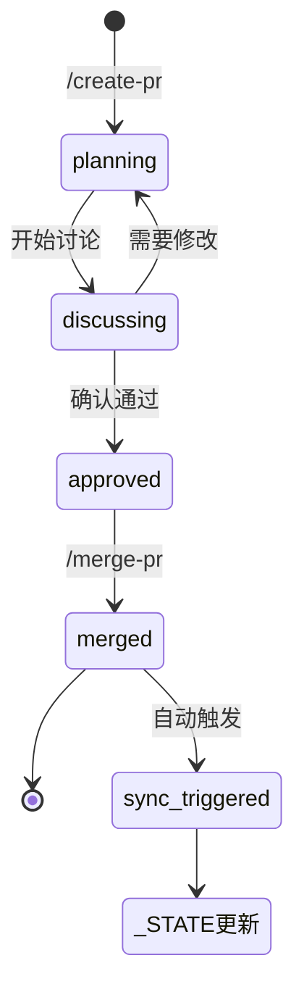

# 论文工程化协作系统：技术架构文档

> **版本**：v0.2.0
> **最后更新**：2025-12-20
> **状态**：自用分支运行中

---

## 1. 系统架构图

```
┌─────────────────────────────────────────────────────────────────────────────┐
│                           论文工程化协作系统                                  │
├─────────────────────────────────────────────────────────────────────────────┤
│                                                                             │
│  ┌─────────────────────────────────────────────────────────────────────┐   │
│  │                         规则层 (.agent/)                             │   │
│  │                                                                       │   │
│  │  rules/                         workflows/                            │   │
│  │  ├── thesis-project.md          ├── start.md                         │   │
│  │  ├── consensus.md               ├── create-pr.md                     │   │
│  │  ├── writing.md                 ├── merge-pr.md                      │   │
│  │  └── context-update.md          ├── add-paper.md                     │   │
│  │                                 ├── ask-academic-ai.md               │   │
│  │  [AI身份/禁令/思维框架]          ├── sync.md ← NEW                    │   │
│  │                                 └── reflect.md ← NEW                 │   │
│  │                                 [操作流程]                            │   │
│  └─────────────────────────────────────────────────────────────────────┘   │
│                                     │                                       │
│                                     ▼                                       │
│  ┌─────────────────────────────────────────────────────────────────────┐   │
│  │                         数据层                                        │   │
│  │                                                                       │   │
│  │  ┌──────────┐ ┌──────────┐ ┌──────────┐ ┌──────────┐ ┌──────────┐  │   │
│  │  │Reference/│ │Consensus/│ │   PR/    │ │ Target/  │ │ 状态文件  │  │   │
│  │  │          │ │          │ │          │ │          │ │          │  │   │
│  │  │PDF-MD/   │ │CON-*.md  │ │PR-*.md   │ │Draft.md  │ │MEMORY.md │  │   │
│  │  │_INDEX.md │ │_CONTEXT  │ │_INDEX.md │ │开题报告  │ │_STATE.md │  │   │
│  │  │          │ │          │ │          │ │          │ │← NEW     │  │   │
│  │  │[文献库]  │ │[讨论记录]│ │[变更管理]│ │[产出物]  │ │[状态同步]│  │   │
│  │  └──────────┘ └──────────┘ └──────────┘ └──────────┘ └──────────┘  │   │
│  └─────────────────────────────────────────────────────────────────────┘   │
│                                     │                                       │
│                                     ▼                                       │
│  ┌─────────────────────────────────────────────────────────────────────┐   │
│  │                         运行时                                        │   │
│  │                                                                       │   │
│  │              AI IDE (Antigravity / Cursor / Claude)                   │   │
│  │                                                                       │   │
│  │  ┌─────────────────────────────────────────────────────────────┐    │   │
│  │  │ 自动加载 .agent/rules/ → 约束AI行为                          │    │   │
│  │  │ 响应 /命令 → 执行对应 workflows/                             │    │   │
│  │  │ 读写数据层 → 按规则操作                                       │    │   │
│  │  └─────────────────────────────────────────────────────────────┘    │   │
│  └─────────────────────────────────────────────────────────────────────┘   │
└─────────────────────────────────────────────────────────────────────────────┘
```

---

## 2. 组件清单

### 2.1 规则层 (`.agent/rules/`)

| 文件 | 职责 | 关键内容 |
|------|------|---------|
| `thesis-project.md` | AI身份与禁令 | 批判性学术伙伴、Chain of Thought、负面约束 |
| `consensus.md` | 学术问答规则 | 四部分提问模板、文献分类（🔴🟡⚪） |
| `writing.md` | 写作规范 | APA第7版、PR驱动修改 |
| `context-update.md` | 进度更新规则 | 何时更新 _CONTEXT.md |

### 2.2 工作流层 (`.agent/workflows/`)

| 命令 | 文件 | 用途 | 版本 |
|------|------|------|------|
| `/start` | start.md | 新对话启动检查 | v0.1 |
| `/create-pr` | create-pr.md | 创建修改请求 | v0.1 |
| `/merge-pr` | merge-pr.md | 合并PR + 引用检查 | v0.1 |
| `/add-paper` | add-paper.md | 添加PDF文献 | v0.1 |
| `/ask-academic-ai` | ask-academic-ai.md | 向学术AI提问 | v0.1 |
| `/analyze-answer` | analyze-answer.md | 分析AI回答 | v0.1 |
| `/deep-read` | deep-read.md | 深度阅读文献 | v0.1 |
| `/sync` | sync.md | 状态同步 | **v0.2 NEW** |
| `/reflect` | reflect.md | 记忆提取 | **v0.2 NEW** |

### 2.3 数据层

| 目录/文件 | 职责 | 当前状态 |
|----------|------|---------|
| `Reference/` | 文献库 | 50+ 篇文献 |
| `Reference/PDF-MD/` | PDF→Markdown | 使用 Datalab API |
| `Reference/_INDEX.md` | 文献索引 | 待重构为分组结构（P1） |
| `Consensus/` | 学术讨论 | 3+ CON 记录 |
| `Consensus/_CONTEXT.md` | 研究进度 | 活跃 |
| `PR/` | 修改请求 | 5 个 PR |
| `Target/Draft.md` | 论文正文 | 60% 完成 |
| `MEMORY.md` | AI笔记 | 活跃 |
| `_STATE.md` | 系统状态快照 | **v0.2 NEW** |

---

## 3. 工作流程图

### 3.1 核心工作循环

```mermaid
flowchart LR
    A[阅读文献] --> B[向学术AI提问]
    B --> C[形成洞见]
    C --> D[创建PR]
    D --> E[讨论确认]
    E --> F[合并PR]
    F --> G[/sync 同步状态]
    G --> A
    
    C -.-> H[/reflect 记忆提取]
    H -.-> I[MEMORY.md]
```

### 3.2 PR 生命周期



### 3.3 /sync 和 /reflect 设计逻辑

```mermaid
flowchart TD
    A[用户调用工作流] --> B{评估是否需要执行}
    B -->|有变化/有价值| C[执行操作]
    B -->|无变化/无价值| D[返回"无需操作"]
    C --> E[输出报告]
    D --> E
```

---

## 4. 设计原则

### 4.1 核心原则

| 原则 | 说明 |
|------|------|
| **PR驱动** | 任何论文修改都通过PR，可追溯 |
| **文献为真** | 论据必须来自Reference/，禁止捏造 |
| **负面约束** | 告诉AI"不能做什么"比"应该做什么"更重要 |
| **评估优先** | 工作流先评估"值不值得做"，"无需操作"是合理结论 |

### 4.2 分层设计

```
规则层（what/why）→ 定义AI的身份、边界、思维方式
工作流层（how）  → 定义具体操作步骤
数据层（where）  → 存储所有知识和状态
运行时（when）   → AI IDE执行规则和工作流
```

---

## 5. 最新变更

### v0.2.0 (2025-12-20)

| 变更 | 类型 | 说明 |
|------|------|------|
| `/sync` 工作流 | 新增 | 状态同步，解决信息孤岛 |
| `/reflect` 工作流 | 新增 | 智能记忆提取 |
| `_STATE.md` | 新增 | 系统状态快照 |
| 评估优先原则 | 设计改进 | 工作流先判断"值不值得做" |

### v0.1.0 (2025-12-14)

| 变更 | 类型 | 说明 |
|------|------|------|
| 初始架构 | 新建 | PR/Consensus/Reference/Target 四层结构 |
| 基础规则 | 新建 | thesis-project, consensus, writing |
| 基础工作流 | 新建 | start, create-pr, merge-pr 等 |

---

## 6. 待办项

| 优先级 | 项目 | 状态 |
|--------|------|------|
| P0 | `/sync` `/reflect` 实际测试 | 待验证 |
| P1 | Reference/_INDEX.md 分组重构 | 待实施 |
| P1 | 参赛分支 OpenAgents 架构 | 设计完成 |
| P2 | 可追溯性增强（引用→原文段落） | 规划中 |

---

## 7. 相关文档

| 文档 | 路径 | 用途 |
|------|------|------|
| README | `/README.md` | 项目介绍 + 使用指南 |
| 业务分析 | `/Reflections/Hackathon/biz-overview.md` | 目标/范围/时间规划 |
| 系统增强方案 | `/Reflections/Hackathon/系统增强方案.md` | 问题诊断 + 行业参考 |
| 参赛架构 | `/Reflections/Hackathon/架构设计_OpenAgents.md` | 6个Agent设计 |
| 系统状态 | `/_STATE.md` | 当前状态快照 |
