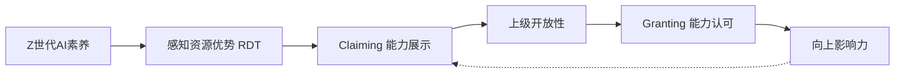

# Task-0002: 理论回溯（RQ2/RQ3相关理论）

> **状态**: 🔄 进行中
> **目标**: 深度提取上级开放性、资源依赖、领导身份建构理论，生成发散式问题池

---

## 设计原则（继承Task-0001）

1. **先发散再收缩**：每个指标先发散出很多问题
2. **侧面/日常化语言**：不直接问想问的，用自然对话方式
3. **反映真实语境**：融入职场实际情境
4. **分人群策略**：不同人群不同问题策略

---

## 一、Detert & Burris 上级开放性框架

**来源**：Detert, J. R., & Burris, E. R. (2007). Leadership behavior and employee voice: Is the door really open?. Academy of Management Journal, 50(4), 869-884.

### 核心定义

> "Managerial openness refers to subordinates' perceptions that their boss **listens to them**, is **interested in their ideas**, gives **fair consideration** to the ideas presented, and at least sometimes **takes action** to address the matter raised."

### 维度分解

| 维度 | 英文 | 核心含义 |
|------|------|----------|
| 1. 倾听 | Listens | 上级是否愿意听下属说话 |
| 2. 兴趣 | Interested | 上级是否对下属的想法感兴趣 |
| 3. 公正考虑 | Fair consideration | 上级是否认真、公平地考虑想法 |
| 4. 采取行动 | Takes action | 上级是否会基于建议采取行动 |

### 相关中介：心理安全（Psychological Safety）

> "员工是否感到'开口是安全的'"

---

### 1.1 倾听（Listens）

**原文定义**：上级是否愿意听下属说话

**发散式问题池**：

| 类型 | 问题 |
|------|------|
| 行为观察 | 你跟上级说话的时候，他一般在干嘛？看着你还是看手机？ |
| 时间分配 | 上级会花多少时间听你说？还是很快打断你？ |
| 主动询问 | 上级会主动问你"最近有什么想法吗"？ |
| 场景差异 | 在会议上和私下，上级听你说话的态度一样吗？ |
| 情绪感知 | 你觉得上级听你说话的时候，是真听还是应付？ |
| 比较感知 | 相比其他同事，上级对你说的话更重视还是差不多？ |
| AI相关 | 当你谈AI相关话题时，上级比平时更愿意听还是不太在意？ |
| 反馈循环 | 说完后上级会给反馈吗？还是就"嗯"一声？ |

---

### 1.2 兴趣（Interested）

**原文定义**：上级是否对下属的想法感兴趣

**发散式问题池**：

| 类型 | 问题 |
|------|------|
| 追问行为 | 你提了一个想法后，上级会追问细节吗？ |
| 好奇表现 | 上级对新事物/新技术表现出好奇心吗？ |
| AI兴趣 | 上级对AI话题有兴趣吗？会主动问你吗？ |
| 请教行为 | 上级有没有在AI方面问过你"这个怎么弄"？ |
| 学习意愿 | 上级有没有表示想学AI？或者让你教他？ |
| 对比其他 | 上级对你的其他（非AI）想法和AI想法的兴趣程度一样吗？ |
| 眼神/表情 | 你说AI的事情时，上级的表情是兴奋、困惑还是无聊？ |
| 后续行动 | 上级听完后会自己去尝试吗？还是听完就完？ |

---

### 1.3 公正考虑（Fair Consideration）

**原文定义**：上级是否认真、公平地考虑下属提出的想法

**发散式问题池**：

| 类型 | 问题 |
|------|------|
| 采纳经历 | 你的建议被采纳过吗？什么建议？ |
| 拒绝解释 | 你的建议没被采纳时，上级会解释原因吗？ |
| 公平感 | 你觉得上级评估你的建议是公平的吗？ |
| 偏见感知 | 你觉得上级会因为你年轻/资历浅而不重视你的意见吗？ |
| 与他人比较 | 同样的建议如果是别人提的，上级会更重视吗？ |
| AI偏见 | 上级对AI相关的建议是更开放还是更保守？ |
| 决策过程 | 上级做决定之前会考虑你的意见吗？还是已经定了再通知你？ |
| 归因方式 | 建议成功了上级会认可你的贡献吗？失败了会怪你吗？ |

---

### 1.4 采取行动（Takes Action）

**原文定义**：上级是否会基于下属的建议采取实际行动

**发散式问题池**：

| 类型 | 问题 |
|------|------|
| 行动实例 | 上级有没有因为你的建议做出过改变？举个例子？ |
| 速度 | 从你提建议到上级行动，一般要多久？ |
| 推动力 | 你需要反复提醒上级才能推动行动吗？ |
| AI相关 | 你的AI建议有被落实过吗？哪些落实了？ |
| 落实程度 | 上级的行动是完全按你说的还是打了折扣？ |
| 阻力来源 | 如果没行动，是上级不想还是有其他阻力？ |
| 资源支持 | 上级会给你资源/时间去实施你的建议吗？ |
| 后续追踪 | 实施后上级会关心效果吗？还是丢给你就不管了？ |

---

### 1.5 心理安全（Psychological Safety）作为中介

**发散式问题池**：

| 类型 | 问题 |
|------|------|
| 安全感知 | 你觉得向上级提建议有风险吗？什么风险？ |
| 最坏情况 | 你担心提了建议后会怎样？被否定？被记恨？ |
| 出错代价 | 如果你的AI建议出了问题，你会被责怪吗？ |
| 尝试空间 | 上级允许你"试错"吗？ |
| 直言顾虑 | 有没有话你想对上级说但选择不说？为什么？ |
| 自我审查 | 你会在脑子里先过滤一遍再说吗？哪些会过滤掉？ |
| 氛围感知 | 你们团队整体是"敢说话"还是"小心翼翼"？ |
| 失败案例 | 有没有因为说了什么而后悔的经历？ |

---

## 二、资源依赖理论（Resource Dependence Theory）

**来源**：Pfeffer & Salancik (1978); Tripathi (2021)

### 核心思想

> 谁控制了组织需要的资源，谁就有权力。权力来自于**资源的重要性**、**不可替代性**和**控制程度**。

### 我们的应用

在我们的研究中，Z世代员工的AI素养可能成为一种"资源优势"，使他们相对于上级获得某种话语权。

---

### 2.1 资源控制（Resource Control）

**发散式问题池**：

| 类型 | 问题 |
|------|------|
| 能力差异 | 你觉得你有什么能力是上级没有的？ |
| AI对比 | 你和上级在AI方面，谁更熟练？差距大吗？ |
| 组织需求 | 你们组织现在需要AI相关的能力吗？迫切吗？ |
| 独特性 | 在团队里，你的AI能力是独一份还是很多人都有？ |
| 信息差 | 你有没有知道一些AI信息是上级不知道的？ |
| 工具专长 | 有没有什么工具只有你会用？ |

---

### 2.2 资源重要性（Resource Importance）

**发散式问题池**：

| 类型 | 问题 |
|------|------|
| 组织重要性 | 你觉得AI能力在你们组织有多重要？ |
| 业务关联 | AI和你们的核心业务有关系吗？ |
| 战略地位 | 领导层有没有说过"我们要重视AI"？ |
| 趋势感知 | 你觉得AI能力在你们组织的重要性是上升还是下降？ |
| 竞争压力 | 你们的竞争对手在用AI吗？你们有压力吗？ |
| 绩效关联 | AI能力会影响你的绩效评估吗？ |

---

### 2.3 资源不可替代性（Resource Non-substitutability）

**发散式问题池**：

| 类型 | 问题 |
|------|------|
| 替代来源 | 上级能从其他渠道获得AI方面的帮助吗？ |
| 外部资源 | 公司有没有请外部专家/顾问来帮忙AI相关的事？ |
| 同事竞争 | 有没有其他同事也很懂AI？你觉得谁更强？ |
| 培训计划 | 公司有没有在培训更多人学AI？ |
| 工具替代 | 上级能不能不通过你，直接用AI工具？ |
| 依赖感知 | 你觉得上级在AI的事情上依赖你吗？程度如何？ |

---

### 2.4 感知资源优势（Perceived Resource Advantage）

**发散式问题池**：

| 类型 | 问题 |
|------|------|
| 优势感知 | 你有没有"在这方面我比上级更懂"的感觉？ |
| 优势来源 | 这种感觉从哪来？经验？学习？年龄？ |
| 优势稳定性 | 你觉得这种优势能持续多久？ |
| 角色反转 | 有没有觉得在AI这件事上，你和上级的角色反过来了？ |
| 心理感受 | 知道自己在某方面比上级强，你什么感觉？ |
| 表达意愿 | 你会让上级知道你在AI方面比较强吗？ |
| 谨慎态度 | 你会不会刻意低调，不展示自己的AI能力？为什么？ |

---

## 三、领导身份建构理论（Leadership Identity Construction）

**来源**：DeRue & Ashford (2010)

### 核心思想

> 领导力不是固定的角色，而是在**互动中建构**的。通过**Claiming**（声称）和**Granting**（授予）的动态过程，个体获得或失去在某领域的影响力。

### 我们的应用

Z世代员工通过展示AI能力（Claiming），可能获得上级的认可（Granting），从而在AI相关事务上建立影响力。

---

### 3.1 Claiming（能力声称/展示）

**原文定义**：主动声称自己在某领域有专业能力

**发散式问题池**：

| 类型 | 问题 |
|------|------|
| 展示行为 | 你会主动展示自己的AI能力吗？怎么展示的？ |
| 展示场景 | 你在什么场合展示AI能力？会议？私聊？工作成果？ |
| 主动vs被动 | 是你主动展示还是别人问你才说？ |
| 展示频率 | 你多久展示一次？经常还是偶尔？ |
| 展示方式 | 你是直接说"我会这个"还是通过做事让人知道？ |
| 展示动机 | 你为什么展示？想获得什么？认可？机会？ |
| 策略考量 | 你会考虑"在谁面前展示"吗？ |
| 风险评估 | 展示AI能力有风险吗？比如被当成"爱表现"？ |

---

### 3.2 Granting（能力认可/授予）

**原文定义**：他人（尤其是上级）承认你的专业能力

**发散式问题池**：

| 类型 | 问题 |
|------|------|
| 认可信号 | 上级有没有表示过认可你的AI能力？怎么表示的？ |
| 言语认可 | 上级说过"你AI很厉害"之类的话吗？ |
| 行为认可 | 上级会把AI相关的事交给你做吗？ |
| 公开认可 | 上级在别人面前提起过你的AI能力吗？ |
| 角色赋予 | 上级有没有让你负责AI相关的项目/决策？ |
| 资源支持 | 上级有没有给你资源/时间去做AI相关的事？ |
| 咨询行为 | 上级遇到AI问题会找你吗？ |
| 决策影响 | 你在AI相关决策上有没有话语权？ |

---

### 3.3 Claiming-Granting 动态循环

**发散式问题池**：

| 类型 | 问题 |
|------|------|
| 正向循环 | 你展示了能力后，上级更认可你了吗？ |
| 负向循环 | 有没有展示了但没被认可的经历？后来怎么办？ |
| 调整策略 | 被接受/拒绝后，你下次的做法会变吗？ |
| 信心变化 | 多次被认可后，你更敢提建议了吗？ |
| 退缩经历 | 有没有因为没被认可就不再主动的时候？ |
| 上级变化 | 上级对你的态度随着时间有变化吗？更重视还是不变？ |
| 关系建立 | 你觉得你和上级在AI方面建立了一种什么样的关系？ |
| 身份认知 | 你觉得自己在团队里是"AI方面的人"吗？ |

---

## 四、三个理论的关系

**说明**：
- RDT解释了为什么AI素养会带来"资源优势"感知
- 领导身份建构解释了从"有能力"到"被认可"的过程
- 上级开放性是这个过程中的关键调节因素

---

## 五、人群分层策略

| 人群 | 重点理论/维度 | 适当跳过 |
|------|--------------|----------|
| **有明确上级的员工** | 上级开放性全维度、Claiming-Granting全维度 | - |
| **自由职业/远程** | 资源优势、Claiming（弱化Granting） | 上级相关问题 |
| **管理层自己** | 反向：下属的Claiming、自己的Granting意愿 | - |

---

## 六、统计

| 理论 | 维度数 | 问题池（约） |
|------|--------|-------------|
| 上级开放性（Detert & Burris） | 4+1 | ~40 |
| 资源依赖（RDT） | 4 | ~25 |
| 领导身份建构（DeRue & Ashford） | 3 | ~25 |
| **合计** | 12 | **~90** |

---

## 七、完成状态

- [x] Detert & Burris 上级开放性深度提取 ✓
- [x] RDT 资源依赖深度提取 ✓
- [x] 领导身份建构深度提取 ✓
- [x] 理论关系图 ✓
