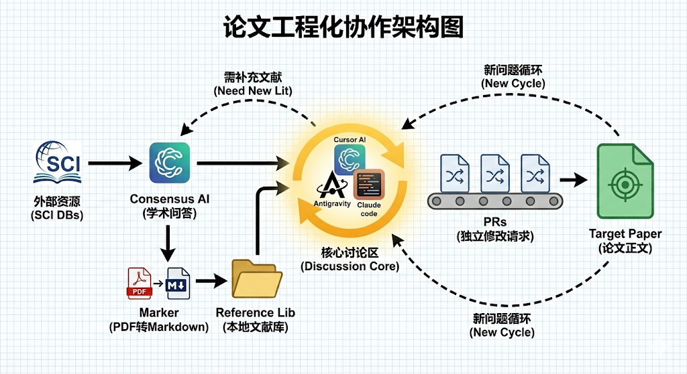

# 论文工程化协作项目

AI 素养对 Z 世代员工向上影响行为的研究

## 工作流架构

## 文件夹结构

| 文件夹 | 职责 | 关键文件 |
|--------|------|----------|
| **PR/** | 论文修改请求，独立完整可执行 | `agent.md`, `_INDEX.md`, `_TEMPLATE.md` |
| **Reference/** | 学术文献库，APA 引用规范 | `agent.md`, `_INDEX.md` |
| **Consensus/** | 学术 AI 问答记录 | `agent.md`, `_INDEX.md`, `_TEMPLATE.md` |
| **Target/** | 论文最终产物 | `agent.md`, `Draft.md` |

## 核心原则

1. **讨论是中心**：所有工作围绕讨论展开
2. **循环迭代**：讨论 → 文献 → 洞见 → PR → 讨论...
3. **PR 独立性**：每个 PR 完整独立，无需上下文即可执行
4. **文献即真相**：Reference 是唯一论据来源
5. **问题要深入**：Consensus 提问须具体，不预设答案

## 快速开始

1. 阅读各文件夹的 `agent.md` 了解使用规则
2. 讨论形成洞见后，创建 PR
3. PR 审核通过后合并至 Target
