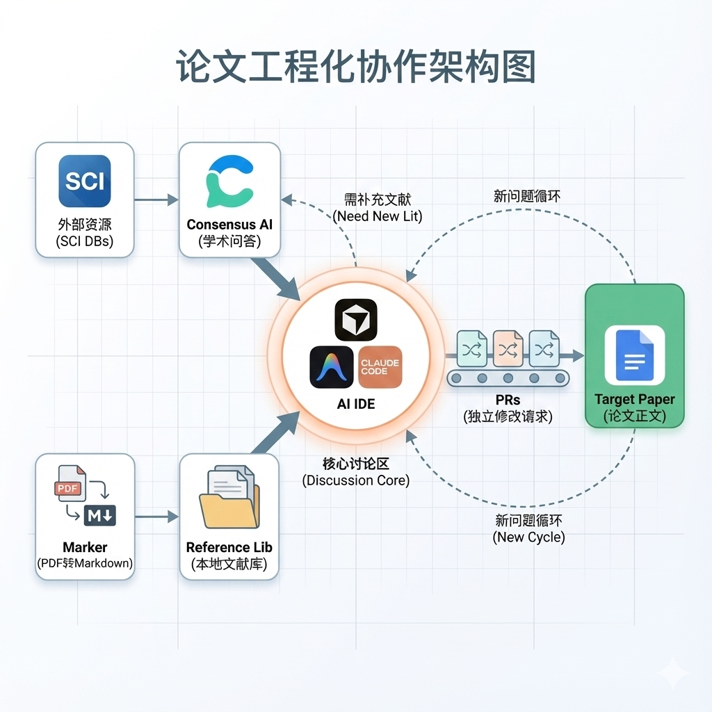

# 论文工程化协作系统

> 以「AI 素养对 Z 世代员工向上影响行为的研究」为例


[](LICENSE)

**📐 [系统架构文档](ARCHITECTURE.md)** | **📋 [更新日志](#更新日志)**

---

论文写作有个奇怪的悖论：我们用最现代的工具检索文献、统计数据，却用最古老的方式组织思想——从头写到尾，写完再改，改完再写。软件工程早就告别了这种线性开发，为什么学术写作还在坚持？

这个项目是一次尝试。把版本控制、代码审查、持续集成的思路搬到论文里来，看看会发生什么。

## 核心想法

**每一次修改都是一个 Pull Request。**

不直接动论文正文。想改什么，先开个PR，写清楚改什么、为什么改、有什么文献支撑。讨论确认后再合并。这样做的好处是：每一个论点的演变都有迹可循，每一次"我当时为什么这么写"都有答案。

**AI 不是写手，是有记忆的研究伙伴。**

让 AI 读你的文献库、记住你的理论框架、了解你的研究进度。它应该能在你问"上级开放性怎么测量"时，直接告诉你 Detert & Burris (2007) 用了6题量表、Cronbach's α = 0.89，而不是泛泛地说"可以用问卷"。

**文献是真相，讨论是中心。**

所有论据必须能追溯到 `Reference/` 里的具体文献。所有洞见都来自与学术 AI 的对话记录。凭空捏造是被禁止的。

## 项目结构

```
Graduate-thesis/
├── Reference/           # 文献库
│   ├── PDF-MD/          # PDF → Markdown 转换（让 AI 能读）
│   └── _INDEX.md        # 文献索引
│
├── Consensus/           # 与学术 AI 的问答记录
│   ├── _CONTEXT.md      # 当前研究进度
│   └── CON-*.md         # 每轮讨论
│
├── PR/                  # 修改请求
│   └── PR-*.md          # 每个修改独立可执行
│
├── Target/              # 产出物
│   └── Draft.md         # 论文正文
│
├── MEMORY.md            # AI 的笔记本（用户偏好、关键洞见）
└── .agent/              # 规则与工作流
    ├── rules/           # AI 行为约束
    └── workflows/       # 操作流程（/start, /create-pr...）
```

## 工作循环

```
阅读文献 → 向学术AI提问 → 形成洞见 → 创建PR → 讨论确认 → 合并 → 更新进度
    ↑                                                              ↓
    └───────────────────── 循环 ←──────────────────────────────────┘
```

不是"写完初稿再修改"，而是"边研究边构建"。论文在循环中生长。

## 怎么用

**如果你是学生，想用这套框架写自己的论文：**

1. Fork 这个仓库
2. 把 PDF 文献扔进 `Reference/PDF-MD/pdfs/`，运行转换脚本
3. 修改 `.agent/rules/thesis-project.md`，替换成你的研究主题和理论框架
4. 开始循环：读文献 → 提问 → 开PR → 合并

**如果你是 AI 开发者，想了解 agent 规则设计：**

看 `.agent/` 目录。每个规则文件定义 AI 的身份、禁令、思维框架；每个工作流文件定义具体操作步骤。核心设计思想是：**负面约束比正面指导更重要**——与其告诉 AI "你应该怎么做"，不如明确"你绝对不能做什么"。

## 关于这篇论文

**主题**：AI 素养如何让 Z 世代员工影响他们的上级

**理论视角**：资源依赖理论——当年轻员工掌握了上级缺乏的 AI 能力，权力天平会发生什么变化？

**方法**：定性研究，15-20 名 Z 世代知识型员工的深度访谈

**当前进度**：文献综述完成，方法论章节完成，准备进入田野

## 一些教训

在实际使用中踩过的坑，记在 `MEMORY.md` 里：

- 简单直接的问题往往比精心设计的长 prompt 更有效
- 合并 PR 时容易遗漏参考文献——后来加了强制 checklist
- 论文修改不能孤立，新内容要和已有引用呼应
- 不是所有文献都要下载，识别比收集更重要

## License

MIT. 随便用。

---

## 可用工作流

| 命令 | 用途 | 说明 |
|------|------|------|
| `/start` | 新对话启动 | 加载项目上下文 |
| `/create-pr` | 创建修改请求 | 任何论文修改都要先开 PR |
| `/merge-pr` | 合并 PR | 执行修改并更新状态 |
| `/add-paper` | 添加文献 | PDF → Markdown 转换 |
| `/ask-academic-ai` | 向学术AI提问 | 使用四部分模板 |
| `/analyze-answer` | 分析AI回答 | 标记文献优先级 |
| `/deep-read` | 深度阅读 | 输出结构化笔记 |
| `/sync` | 同步状态 | 更新 `_STATE.md`，解决信息孤岛 |
| `/reflect` | 记忆提取 | 对话后提取值得记的内容 |

> **设计原则**：`/sync` 和 `/reflect` 不是执行器，先评估"值不值得做"。"无需操作"是合理结论。

---

## 更新日志

### v0.2.0 (2025-12-20)

**新增**
- `/sync` 工作流：系统状态同步，解决"部分遵循"和"信息孤岛"问题
- `/reflect` 工作流：对话后智能记忆提取，借鉴 Mem0 的 prompt 设计
- `_STATE.md`：系统状态快照文件，集中管理元信息
- 评估优先原则：工作流先判断"值不值得做"

**改进**
- 工作流设计理念："无需操作"是合理结论

### v0.1.0 (2025-12-14)

**初始版本**
- PR 驱动的论文修改管理
- Consensus 结构化学术讨论
- Reference 文献库 + PDF→Markdown
- `.agent/rules/` 负面约束设计
- 基础工作流：/start, /create-pr, /merge-pr, /add-paper, /ask-academic-ai

---

> *写论文不该像在黑暗中摸索。每一步都应该知道自己在哪、来自哪里、要去哪里。*
