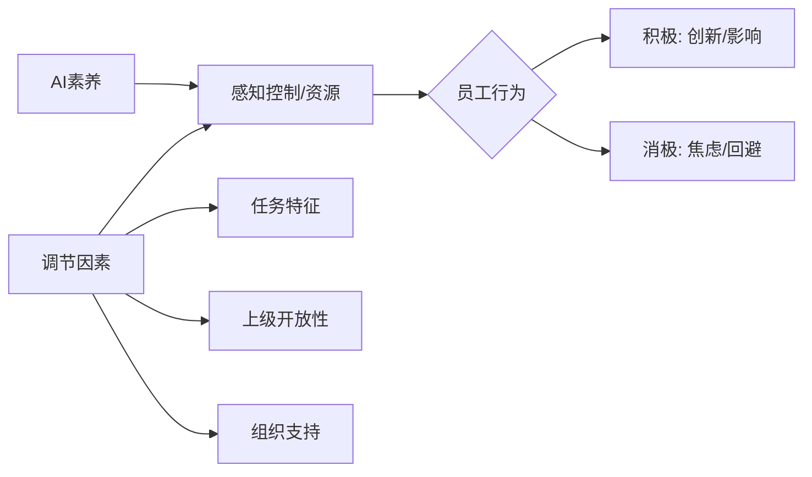

# 批次A：AI素养与AI工作影响 阅读笔记

> 创建日期: 2025-12-16
> 负责AI: 当前会话
> 输出目录: Reference/Note/

---

## 第一篇：尹开国 (2024)

### 基本信息

| 项目 | 内容 |
|------|------|
| **标题** | 人工智能素养:提出背景、概念界定与构成要素 |
| **期刊** | 图书情报工作 |
| **评价** | 🟡 间接参考价值 |

### 核心贡献

**1. AI素养五维框架（KSAVE模型参考）**

```
AI意识 → AI认知 → AI技能 → AI思维 → AI伦理
   ↓         ↓         ↓         ↓         ↓
  先导      基础      实践      高阶      底层
```

**2. AI素养定义**

"在日常生活、学习和工作场景中，个体在接触、理解、评估、利用AI技术和应用过程中体现出的综合能力、行为方式和伦理价值观。"

**3. 关键洞见**

- AI素养是多样化、多层次概念
- **人机协同共生**是AI素养的差异化内涵
- AI素养区别于数字素养的核心：AI的自主性、学习性、不可解释性

### 对我们研究的贡献

**支撑P1（AI素养定义）：**
- 提供另一种五维框架参考
- 强调"人机协同"——与我们的资源依赖视角呼应
- 非专业人士的通识性素养定义

**局限：**
- 教育导向，未涉及职场应用
- 理论性强，缺乏实证测量

---

## 第二篇：赵益民、彭雪琴、寸国美 (2025)

### 基本信息

| 项目 | 内容 |
|------|------|
| **标题** | 人工智能素养的内涵、结构和评价体系 |
| **期刊** | 图书情报工作 |
| **DOI** | 10.13266/j.issn.0252-3116.2025.13.007 |
| **评价** | 🔴 直接可用于论文 |

### 核心贡献

**1. AI素养四维框架（CKCE模型）**

| 维度 | 角色 | 权重 |
|------|------|------|
| Consciousness (意识) | 先导 | 0.132 |
| Knowledge (知识) | 基础 | 0.279 |
| Capabilities (能力) | 核心 | 0.425 |
| Ethics (伦理) | 保障 | 0.163 |

**2. 实证测量（N=871高中生）**

- 设计14个二级指标、24题量表
- Cronbach's α = 0.884
- KMO = 0.897
- 熵权法确定权重

**3. 关键发现**

- AI能力权重最高(0.425) → 实践应用是核心
- 人工智能意识和伦理表现较好，能力有待提升

### 对我们研究的贡献

**支撑P1（AI素养操作化）：**
- 提供可信的测量框架参考
- 四维结构可与钟柏昌三维对比
- 实证验证增强可信度

**可引用于方法论：**
- 访谈可参考其维度设计
- 权重分配思路可借鉴

---

## 第三篇：张恒、高中华、徐燕 (2024)

### 基本信息

| 项目 | 内容 |
|------|------|
| **标题** | AI技术替代感对工作场所人与AI合作意愿的影响机制 |
| **期刊** | 软科学 |
| **DOI** | 10.13956/j.ss.1001-8409.2024.03.15 |
| **评价** | 🔴 直接可用于论文 |

### 核心贡献

**1. 研究模型（情绪认知评价理论）**

```
AI技术替代感 → AI焦虑(-) → 人与AI合作意愿(-)
       ↓
    控制感(调节)：高控制感缓冲负面效应
```

**2. 实证结果（N=364，两阶段问卷）**

| 路径 | 效应值 |
|------|--------|
| AI替代感→AI焦虑 | β=0.365*** |
| AI焦虑→合作意愿 | β=-0.295*** |
| 替代感→合作意愿(直接) | β=-0.031 (n.s.) |
| 控制感调节 | β=-0.190*** |

**3. 关键洞见**

- AI焦虑完全中介替代感→合作意愿
- **控制感**是关键调节变量：高控制感员工更少焦虑
- "技术认知—情绪反应—行为意愿"逻辑框架

### 对我们研究的贡献

**支撑整体框架（反面论证）：**
- AI替代感是威胁认知 vs AI素养是资源认知
- 高AI素养 ≈ 高控制感 → 更愿意合作/影响
- 情绪认知评价理论可作为补充理论视角

**支撑P1-P2逻辑：**
- AI素养(高)→ 感知资源优势(高)→ 愿意向上影响(高)
- 与本研究形成"威胁vs机会"的对照

---

## 第四篇：陈淑娴、马淑如、陆毅然 (2025)

### 基本信息

| 项目 | 内容 |
|------|------|
| **标题** | 人机协同关系与员工创新——基于领导授权的中介机制 |
| **期刊** | 技术与创新管理 |
| **DOI** | 10.3969/j.issn.1672-2272.202506059 |
| **评价** | 🔴 直接可用于论文 |

### 核心贡献

**1. 研究模型（CB-SEM, N=1561）**

```
人机协同 ─┬─→ 领导授权 ───→ 员工创新
人机关系 ─┘      (中介)
```

**2. 核心发现**

| 路径 | 效应值 |
|------|--------|
| 人机协同→领导授权 | β=0.360*** |
| 人机协同→员工创新(直接) | β=0.310*** |
| 人机关系→领导授权 | β=0.204*** |
| 领导授权→员工创新 | β=0.161*** |
| 人机协同→创新(间接via授权) | β=0.058*** |

**3. 理论贡献**

- **人机协同促进领导授权**：消弭权力势差、提升员工能力
- 领导授权是关键情境资源
- "自主性—多样性—支持性"人机协同工作系统

### 对我们研究的贡献

**直接支撑P4（上级开放性调节）：**
- "领导授权"概念与"上级开放性"高度相关
- 人机协同→领导授权路径验证
- 授权作为中介 ≈ 开放性作为边界条件

**支撑整体框架：**
- 人机协同→创新 ≈ AI素养→向上影响
- 证明AI相关因素可以促进积极员工行为

---

## 阅读进度

### 已完成
- [x] 尹开国(2024) AI素养五维框架 🟡
- [x] 赵益民等(2025) AI素养四维+实证 🔴
- [x] 张恒等(2024) AI替代感→焦虑→合作意愿 🔴
- [x] 陈淑娴等(2025) 人机协同→领导授权→创新 🔴

### 待阅读
- [ ] 数智时代的人工智能素养
- [ ] 纵横视角下人工智能素养
- [ ] AI创造力感知双刃剑
- [ ] 人工智能时代Z世代自我角色
- [ ] The future of AI at work (英文)
- [ ] Human-AI collaboration (英文)
- [ ] Ethics of AI (英文)
- [ ] 其他英文文献

---

## 阶段性发现

### AI素养定义比较

| 来源 | 维度 | 特点 |
|------|------|------|
| 钟柏昌等(2024) | 知识/情感/思维 | 本研究采用 |
| 尹开国(2024) | 意识/认知/技能/思维/伦理 | KSAVE参考 |
| 赵益民等(2025) | 意识/知识/能力/伦理 | 实证验证 |
| Long & Magerko(2020) | 批判评估/沟通协作/工具使用 | 国际广引 |

### 关键机制对比

| 研究 | 自变量 | 中介 | 因变量 | 理论 |
|------|--------|------|--------|------|
| 张恒等(2024) | AI替代感(-) | AI焦虑 | 合作意愿 | 情绪认知评价 |
| 陈淑娴等(2025) | 人机协同(+) | 领导授权 | 员工创新 | 资源保存 |
| 本研究 | AI素养(+) | 感知资源优势 | 向上影响 | 资源依赖 |

---

## 第五篇：Langer & Landers (2023)

### 基本信息

| 项目 | 内容 |
|------|------|
| **标题** | The future of artificial intelligence at work: A review on effects of decision automation and augmentation on workers targeted by algorithms and third-party observers |
| **期刊** | Computers in Human Behavior |
| **评价** | 🔴 **极其重要**：系统性综述，提供理论框架 |

### 核心贡献

**1. 利益相关者分类**

```
First Party (第一方): 使用AI系统做决策的人 (如HR经理)
Second Party (第二方): 被AI决策直接影响的人 (如求职者、员工)
Third Party (第三方): 观察AI决策的人 (如公众)
```

**2. AI决策对员工的三类影响**

| 类别 | 子维度 | 发现 |
|------|--------|------|
| **态度** | 信任评估 | 对系统能力评估不一致；认为系统更客观但缺乏仁慈 |
| | 还原论 | 认为AI忽视个体独特性、定性信息 |
| | 道德决策抵触 | 不希望AI做道德相关决策 |
| **感知** | 公平与公正 | 混合结果；程序公正(一致性↑, 可控性↓) |
| | 组织吸引力 | 人事选拔中使用AI↓吸引力 |
| | 隐私担忧 | AI决策引发更高隐私担忧 |
| **行为** | 逆向工程 | 员工尝试理解算法运作 |
| | 规避策略 | 利用系统漏洞规避控制 |
| | 集体行动 | 在线论坛分享知识、组织抗议 |

**3. 关键调节变量**

| 调节类别 | 变量 | 效应 |
|----------|------|------|
| 决策过程 | 人机控制分配 | 增强(人控)→更高公平感知 |
| 系统特征 | 透明度/解释 | 效果不一致；可能适得其反 |
| | 系统绩效 | 准确性显著优于人时才被接受 |
| 个体特征 | 经验/熟悉度 | 更高熟悉度→更积极态度 |
| | 性别 | 女性倾向更负面反应 |
| 任务特征 | 高风险任务 | 反应更负面 |
| | 需人类技能 | AI用于此类任务→更负面 |

### 对我们研究的贡献

**支撑整体框架：**
1. **员工视角(Second Party)**：本研究关注的Z世代员工正是"被AI影响的一方"
2. **从被动到主动**：综述显示员工会"逆向工程"、寻找规避策略——这与"向上影响"行为逻辑一致
3. **资源与控制**：高AI熟悉度→更积极态度 ≈ 高AI素养→感知资源优势

**支撑P1-P2逻辑链：**
```
Langer & Landers发现:
  高AI熟悉度 → 更高感知控制 → 更积极态度/行为

本研究命题:
  高AI素养 → 感知资源优势 → 向上影响行为
```

**方法论启示：**
- 综述指出vignette研究局限性——支持我们用质性方法
- 强调需要关注真实工作场景——验证我们的访谈设计

---

## 阅读进度更新

### 已完成
- [x] 尹开国(2024) AI素养五维框架 🟡
- [x] 赵益民等(2025) AI素养四维+实证 🔴
- [x] 张恒等(2024) AI替代感→焦虑→合作意愿 🔴
- [x] 陈淑娴等(2025) 人机协同→领导授权→创新 🔴
- [x] **Langer & Landers (2023) AI工作决策综述 🔴🔴**

### 待阅读
- [ ] 数智时代的人工智能素养
- [ ] 纵横视角下人工智能素养
- [ ] AI创造力感知双刃剑
- [ ] 人工智能时代Z世代自我角色
- [ ] Human-AI collaboration
- [ ] Ethics of AI
- [ ] AI与员工创新的双刃剑效应

---

## 累积理论发现

### 核心机制对比表（更新）

| 来源 | 自变量 | 中介/机制 | 因变量 | 理论基础 |
|------|--------|-----------|--------|----------|
| 张恒等(2024) | AI替代感(-) | AI焦虑 | 合作意愿 | 情绪认知评价 |
| 陈淑娴等(2025) | 人机协同(+) | 领导授权 | 员工创新 | 资源保存 |
| Langer&Landers(2023) | AI熟悉度(+) | 感知控制 | 态度/行为 | 多理论整合 |
| **本研究** | **AI素养(+)** | **感知资源优势** | **向上影响** | **资源依赖** |

### AI素养→员工行为的理论路径



---

## 第六篇：叶慧莉等 (2025)

### 基本信息

| 项目 | 内容 |
|------|------|
| **标题** | AI创造力感知影响员工创新行为的双刃剑机制研究 |
| **期刊** | 管理学报 |
| **方法** | 经验取样法(ESM) + 多层次分析，103人×5天 + 385对稳健性检验 |
| **评价** | 🔴🔴 **极其重要**：方法论和理论都高度契合 |

### 核心发现

**双刃剑模型：**
```
AI创造力感知
    ├─(+)→ 创造力自我效能感 → (+) 员工创新行为
    └─(+)→ 技术焦虑 → (-) 员工创新行为
    
调节变量：AI学习目标导向
    - 高AI学习目标导向：强化正向路径
    - 低AI学习目标导向：负向路径更显著
```

**关键效应量：**
| 路径 | 系数 | 显著性 |
|------|------|--------|
| AI感知→创造力自我效能感 | 0.260 | p<0.01 |
| AI感知→技术焦虑 | 0.208 | p<0.05 |
| 创造力自我效能感→创新行为 | 0.196 | p<0.05 |
| 技术焦虑→创新行为 | -0.119 | p<0.05 |

**ICC值说明变量波动：**
- AI创造力感知 ICC(1)=0.644（个体内方差35.8%）
- 证明日常波动存在，支持ESM设计

### 对我们研究的贡献

**方法论启示：**
1. 证明AI感知具有日内波动，可采用ESM
2. 但本研究采用质性访谈也合理——深度解释机制

**理论支持P1-P2：**
```
叶慧莉等：
  AI创造力感知 → 创造力自我效能感(+) → 创新行为

本研究类比：
  AI素养 → 感知资源优势(认知评估) → 向上影响
```

**"AI学习目标导向"的启示：**
- 高AI学习导向者更能将AI感知转化为积极行为
- 对比本研究：高AI素养者更可能感知资源优势

---

## 第七篇：Nebgen & Kurz (2024)

### 基本信息

| 项目 | 内容 |
|------|------|
| **标题** | Generation Z: AI Affinity and Adoption in Competitive German Organisations |
| **期刊** | Journal of Next-Generation Research 5.0 |
| **方法** | 混合方法：n=202 + n=345 LinkedIn调查，2024年12月 |
| **评价** | 🔴 **直接相关**：提供Gen Z + AI的最新实证数据 |

### 核心发现

**1. 代际AI使用差异（德国数据）：**

| 代际 | AI服务使用率 | 喜欢尝试新技术 | 技术自信 |
|------|-------------|----------------|----------|
| Z世代(18-27) | 41% | 54.8% | 44.7% |
| Y世代(28-42) | 29% | 43.5% | 39.3% |
| X世代(43-60) | 13% | 32.5% | 30.6% |

**2. Gen Z在AI整合中的角色：**
- **58.42%** 受访者认为Gen Z在AI整合中扮演核心角色
- **73%** 的16-29岁认为工作场所将被数字化塑造

**3. AI对竞争力的影响：**
- 69.57%认为3-5年内不用AI也能保持竞争力
- 但85%认为AI对组织具有高度或极高相关性

**4. Gen Z对AI的担忧：**
- **62%** 担心AI导致失业（General Assembly调查）
- **88%** 使用AI提高效率（TalentLMS）
- **46%** 更愿意问AI而非同事

### AI实施成功的目标函数

论文提出形式化模型：
```
S_AI = f(α, β, γ, δ, ε, ζ, η, θ, ι, κ)

其中：
α = 技术接受度
β = 培训强度
γ = 系统透明度
δ = 工作场所设计
ε = 企业文化
ζ = 数据安全
η = 创新导向文化
θ = 变革管理能力
ι = 技术基础设施
κ = 代际协作
```

### 对我们研究的贡献

**直接支撑引言数据：**
1. 量化证据：Gen Z确实技术适应性更强（41% vs 13%）
2. Gen Z被视为AI整合的核心推动者（58.42%）
3. 数字化工作预期存在代际差异

**支撑研究问题的必要性：**
```
研究背景支持：
- Gen Z高技术亲和力 → 但如何转化为工作行为？
- Gen Z担忧失业(62%) → 资源依赖心理？
- 代际数字鸿沟 → 创造潜在的资源不对称
```

**"代际协作(κ)"变量的启示：**
- 组织层面因素可能调节个体行为
- 与本研究的"上级开放性"类似

---

## 阅读进度更新

### 已完成（7篇）
- [x] 尹开国(2024) AI素养五维框架 🟡
- [x] 赵益民等(2025) AI素养四维+实证 🔴
- [x] 张恒等(2024) AI替代感→焦虑→合作意愿 🔴
- [x] 陈淑娴等(2025) 人机协同→领导授权→创新 🔴
- [x] **Langer & Landers (2023) AI工作决策综述 🔴🔴**
- [x] **叶慧莉等(2025) AI创造力双刃剑ESM 🔴🔴**
- [x] **Nebgen & Kurz (2024) Gen Z AI Adoption 🔴**

### 待阅读
- [ ] Human-AI collaboration taxonomy
- [ ] Ethics of AI
- [ ] AI as talent management tool
- [ ] 数智时代的人工智能素养
- [ ] Unpacking human-AI interaction

---

## 累积理论发现（更新）

### 核心机制对比表

| 来源 | 自变量 | 中介/机制 | 因变量 | 理论 | 方法 |
|------|--------|-----------|--------|------|------|
| 张恒等(2024) | AI替代感(-) | AI焦虑 | 合作意愿 | 情绪认知评价 | 问卷 |
| 陈淑娴等(2025) | 人机协同(+) | 领导授权 | 员工创新 | 资源保存 | 问卷 |
| Langer等(2023) | AI熟悉度(+) | 感知控制 | 态度/行为 | 综合 | 综述 |
| **叶慧莉等(2025)** | **AI创造力感知** | **双路径** | **创新行为** | **社会信息加工** | **ESM** |
| **本研究** | **AI素养(+)** | **感知资源优势** | **向上影响** | **资源依赖** | **质性** |

### 关键洞见汇总

**1. AI认知→行为的双刃剑效应已被证实**
- 叶慧莉等：创造力自我效能(+) vs 技术焦虑(-)
- 本研究应关注：感知资源优势(+) vs 可能的负面路径?

**2. 个体特质调节作用重要**
- 叶慧莉等：AI学习目标导向
- 本研究：AI素养本身就是调节个体如何解读AI情境

**3. Gen Z确实具有独特的AI关系**
- 量化证据支持更高技术接受度
- 但也存在独特担忧（失业、监控）
- 这些担忧可能驱动"资源获取"动机

### 待解答的理论问题

1. 感知资源优势是否也存在"双刃剑"？
2. AI素养高但上级封闭时，员工会如何选择策略？
3. 向上影响成功/失败经历如何反馈到AI素养发展？

---

## 第八篇：Gomez et al. (2025)

### 基本信息

| 项目 | 内容 |
|------|------|
| **标题** | Human-AI collaboration is not very collaborative yet: a taxonomy of interaction patterns in AI-assisted decision making from a systematic review |
| **期刊** | Frontiers in Computer Science |
| **方法** | 系统性综述，105篇文章，131个交互序列 |
| **评价** | 🟡 **间接相关**：提供人机交互分析框架 |

### 核心贡献

**1. 七种人机交互模式分类法：**

| 模式 | 描述 | 出现频率 |
|------|------|----------|
| **AI-first assistance** | AI建议与问题同时呈现 | n=67 (最常见) |
| **AI-follow assistance** | 用户先形成判断，再看AI建议 | n=28 |
| **Secondary assistance** | AI提供间接信息，非直接答案 | n=16 |
| **Request-driven AI** | 用户主动请求AI帮助 | n=25 |
| **AI-guided dialogic** | AI引导对话式交互 | n=6 |
| **User-guided interactive** | 用户可修改AI输出 | n=9 |
| **Delegation** | 任务在人机间分配 | n=9 |

**2. 交互构建块(Building Blocks)：**
- Predict - Outcome
- Decide - Outcome
- Display - Information
- Request - Outcome/Information
- Modify - Outcome/Information
- **Delegate - Decision** ← 与向上影响相关

**3. 关键发现：**
- 当前人机协作多为简单模式（AI-first/AI-follow占72%）
- 真正的"协作"交互（Dialogic, Interactive, Delegation）很少
- 高风险领域（医疗、金融）有更多交互模式探索

### 对我们研究的贡献

**概念框架启示：**
```
Gomez等的"交互模式"视角：
  员工如何与AI交互 → 影响决策过程

类比到本研究：
  员工AI素养水平 → 影响如何"利用"AI资源
  → 影响向上影响策略选择
```

**"Delegation"模式的启示：**
- 委托涉及"评估谁更能完成任务"的认知
- 这与"感知资源优势"的逻辑高度一致：
  - 员工评估自己 vs 上级在AI资源上的优势
  - 决定是否"委托"决策权给自己

**方法论启示：**
- 分类法可用于编码访谈数据
- 识别员工描述的与AI/上级的交互模式

### 局限性
- 关注人-AI交互，未涉及人-人关系
- 医疗/金融领域为主，职场一般情境较少

---

## 阅读进度更新

### 已完成（8篇）
- [x] 尹开国(2024) AI素养五维框架 🟡
- [x] 赵益民等(2025) AI素养四维+实证 🔴
- [x] 张恒等(2024) AI替代感→焦虑→合作意愿 🔴
- [x] 陈淑娴等(2025) 人机协同→领导授权→创新 🔴
- [x] Langer & Landers (2023) AI工作决策综述 🔴🔴
- [x] 叶慧莉等(2025) AI创造力双刃剑ESM 🔴🔴
- [x] Nebgen & Kurz (2024) Gen Z AI采纳 🔴
- [x] **Gomez et al. (2025) Human-AI交互分类法 🟡**

### 待阅读
- [ ] Ethics of AI
- [ ] AI as talent management tool
- [ ] Unpacking human-AI interaction

---

## 批次A阶段性总结

### 理论收获

**1. AI素养定义已明确**
- 采用钟柏昌(2024)三维框架：知识+情感+思维
- 其他框架（尹开国、赵益民）作为补充参考

**2. AI认知→行为的机制已有丰富文献支持**
| 机制类型 | 正向路径 | 负向路径 |
|----------|----------|----------|
| 情绪 | 创造力自我效能感 | 技术焦虑、AI焦虑 |
| 认知 | 感知资源优势 | 替代感、威胁感知 |
| 行为 | 创新、合作 | 沉默、回避 |

**3. Gen Z + AI的实证证据充分**
- 代际AI使用差异明确（41% vs 13%）
- Gen Z被视为AI整合的核心推动者
- 但也存在独特担忧（失业、监控）

### 理论缺口（本研究填补）

1. **缺乏"资源依赖"视角**
   - 现有研究多用情绪理论、资源保存理论
   - 本研究引入资源依赖理论解释向上影响

2. **缺乏"向上影响"作为因变量**
   - 现有研究关注创新、合作、建言
   - 本研究聚焦于更主动的向上影响行为

3. **缺乏"中介机制"的深度探索**
   - "感知资源优势"是待验证的新概念
   - 通过质性研究探索其内涵

---

## 第九篇：蔡迎春等 (2024)

### 基本信息

| 项目 | 内容 |
|------|------|
| **标题** | 数智时代的人工智能素养：内涵、框架与实施路径 |
| **期刊** | 中国图书馆学报 |
| **视角** | 高校图书馆素养教育 |
| **评价** | 🟡 **间接相关**：提供KSAVE框架，面向非专业群体 |

### 核心贡献

**1. AI素养层次分化：**
```
群体分化：
├─ AI开发者：编程、算法复杂性
└─ 普通大众（消费者）：
   ├─ AI知识（无需编程）
   ├─ AI技能（使用/评估）
   ├─ AI态度
   ├─ AI价值观
   └─ AI伦理
```

**2. KSAVE框架：**
| 维度 | 内容 |
|------|------|
| Knowledge | 理解AI概念、应用潜力和局限 |
| Skills | 使用、评估、创造AI |
| Attitudes | 对AI技术的接受度和使用意愿 |
| Values | 使用AI时的道德考虑 |
| Ethics | AI使用的社会责任感 |

**3. 信息素养→数字素养→AI素养演进：**
- AI素养是数字素养在AI时代的升级
- 但不需要编程/算法能力

### 对我们研究的贡献

**定义参考：**
- 强化"AI素养适用于非专业人士"的立场
- 与钟柏昌(2024)三维框架可对比

**局限**：
- 图书馆教育视角，非职场情境
- 未涉及AI素养与工作行为关系

---

## 第十篇：Khan et al. (2022)

### 基本信息

| 项目 | 内容 |
|------|------|
| **标题** | Ethics of AI: A Systematic Literature Review of Principles and Challenges |
| **期刊** | EASE (ACM) |
| **方法** | SLR，27篇文献 |
| **评价** | 🟡 **间接相关**：AI伦理框架为边界条件 |

### 核心发现

**1. 22个AI伦理原则（频率排序）：**

| 排名 | 原则 | 频率 | 与本研究相关性 |
|------|------|------|----------------|
| 1 | **透明度(Transparency)** | n=17 | 🔴 高——上级开放性前提 |
| 2 | **隐私(Privacy)** | n=16 | 🟡 |
| 3 | **问责制(Accountability)** | n=15 | 🔴 高 |
| 4 | **公平(Fairness)** | n=14 | 🔴 高 |
| 5 | 自主性(Autonomy) | n=10 | 🟡 |
| 6 | 可解释性(Explainability) | n=8 | 🟡 |

**2. 15个AI伦理挑战（主题分类）：**

| 主题 | 挑战 |
|------|------|
| **知识与专业** | 缺乏伦理知识(n=5)、原则模糊(n=3)、高度笼统(n=2) |
| **组织管理** | 商业利益、缺乏审计、跨文化合作问题 |
| **工具与技术** | 实践冲突、机器扭曲、缺乏法律框架 |

### 对我们研究的贡献

**理论边界：**
- 透明度原则支持"上级开放性"调节变量
- 问责制和公平原则与组织公正交叉

**方法论提醒：**
- AI伦理尚未成熟，研究空间大
- 现有原则"高度笼统"——需情境化研究

---

## 第十一篇：Bennett & Martin (2025)

### 基本信息

| 项目 | 内容 |
|------|------|
| **标题** | AI as a talent management tool: An organizational justice perspective |
| **期刊** | Business Horizons (预印本) |
| **方法** | 理论框架 |
| **评价** | 🔴 **直接相关**：组织公正视角解读AI在职场的应用 |

### 核心框架

**组织公正四维度与AI：**

| 公正维度 | 定义 | AI带来的风险 | 管理建议 |
|----------|------|--------------|----------|
| **分配公正** | 结果分配公平感 | 工作流失、薪酬变化 | 审计AI决策、提供再培训 |
| **人际公正** | 尊重与尊严 | AI决策"无人情味" | 保持人工接触点 |
| **信息公正** | 信息沟通质量 | "黑箱"不透明 | 培训员工理解AI |
| **程序公正** | 决策程序公平 | 无法申诉AI裁决 | 建立申诉机制 |

**程序公正六规则：**
1. 一致性(Consistency)
2. 偏见抑制(Bias suppression)
3. 准确性(Accuracy)
4. 可纠正性(Correctability)
5. 代表性(Representativeness)
6. 伦理性(Ethicality)

### 对我们研究的贡献

**直接理论支持：**
```
Bennett & Martin的逻辑：
AI使用 → 员工公正感知 → 态度/行为

本研究类比：
AI素养 → 感知资源优势 → 向上影响行为

关键补充：
上级开放性 ≈ 员工感知到的"程序公正"
```

**关键洞见：**
1. **"人-机回圈"悖论**：
   - 员工不信任"黑箱"，要求人工参与
   - 但AI的初衷恰是消除人类偏差
   - 本研究中：Z世代AI素养高→可能更接受AI决策
   
2. **分配公正担忧**：
   - AI改变工作内容 → 员工感觉角色被削弱
   - 这可能激发向上影响行为——争取话语权

3. **"代表性"规则**：
   - 员工希望参与AI设计和实施
   - 与本研究"向上影响"作为员工主动性行为一致

---

## 阅读进度更新

### 已完成（11篇）
- [x] 尹开国(2024) AI素养五维框架 🟡
- [x] 赵益民等(2025) AI素养四维+实证 🔴
- [x] 张恒等(2024) AI替代感→焦虑→合作意愿 🔴
- [x] 陈淑娴等(2025) 人机协同→领导授权→创新 🔴
- [x] Langer & Landers (2023) AI工作决策综述 🔴🔴
- [x] 叶慧莉等(2025) AI创造力双刃剑ESM 🔴🔴
- [x] Nebgen & Kurz (2024) Gen Z AI采纳 🔴
- [x] Gomez et al. (2025) Human-AI交互分类法 🟡
- [x] **蔡迎春等(2024) KSAVE素养框架 🟡**
- [x] **Khan et al. (2022) AI伦理SLR 🟡**
- [x] **Bennett & Martin (2025) AI人才管理公正 🔴**

### 待阅读（7篇）
- [ ] 纵横视角下人工智能素养
- [ ] 人工智能时代下"Z世代"员工的自我角色认知
- [ ] 人工智能视阈下智力资本
- [ ] Unpacking human-AI interaction
- [ ] 人工智能赋能企业工商管理
- [ ] Allying with AI / Outcome and race（招聘相关）
- [ ] In consilium apparatus（企业绩效）

---

## 批次A累积发现更新

### AI对员工行为的影响路径对比

| 来源 | 自变量 | 中介/机制 | 因变量 | 边界条件 |
|------|--------|-----------|--------|----------|
| 张恒等 | AI替代感 | AI焦虑 | 合作意愿 | 感知控制 |
| 叶慧莉等 | AI创造力感知 | 创造力自效/技术焦虑 | 创新行为 | AI学习导向 |
| **Bennett&Martin** | **AI使用** | **公正感知** | **态度/行为** | **程序公正(6规则)** |
| **本研究** | **AI素养** | **感知资源优势** | **向上影响** | **上级开放性** |

### 上级开放性的理论基础强化

Bennett & Martin(2025)的"程序公正"提供补充视角：
- 上级开放性 ≈ 信息公正 + 程序公正的代表性规则
- 当上级开放时，员工感知到：
  - 决策透明（信息公正）
  - 有发言权（代表性）
  - 可申诉（可纠正性）

### 待解答的理论问题（更新）

1. 感知资源优势与组织公正感知的区分/交叉？
2. AI素养高的员工是否更少受"黑箱焦虑"影响？
3. 上级开放性如何与AI透明度相互作用？

---

## 第十二篇：张薇等 (2024)

### 基本信息

| 项目 | 内容 |
|------|------|
| **标题** | 人工智能视阈下智力资本如何影响科技人员创新工作行为——基于交互调节效应模型 |
| **期刊** | 科技进步与对策 |
| **样本** | 474名制造业科技人员 |
| **评价** | 🟡 **间接相关**：提供AI情境下员工创新行为的机制模型 |

### 核心框架

**企业创新知识基础观(KBV) + JD-R模型：**

```
智力资本三维度：
├─ 人力资本(HC) → 创新工作行为 (+)
├─ 社会资本(SC) → 创新工作行为 (+)
└─ 组织资本(OC) → 创新工作行为 (倒U型)

调节变量：
├─ 职业可持续性感知（工作资源）
└─ AI技术抵制（工作要求）
```

### 关键发现

**1. 主效应：**
- 人力资本 → 创新工作行为：β=0.522***
- 社会资本 → 创新工作行为：β=0.529***
- 组织资本 → 创新工作行为：倒U型（过高组织资本反而抑制创新）

**2. 交互调节效应：**
| 条件 | 效果 |
|------|------|
| 高职业可持续性 + 低AI技术抵制 | 放大正向效应 |
| 低职业可持续性 + 高AI技术抵制 | 削弱正向效应 |

**3. 核心洞见：**
> "AI技术抵制是人机协同新模式下导致的工作要求，而职业可持续性感知可被看作为工作资源"

### 对我们研究的贡献

| 方面 | 贡献 |
|------|------|
| **JD-R框架** | 可借鉴：AI素养作为工作资源 |
| **调节逻辑** | 技术抵制 vs 接受的调节机制 |
| **样本价值** | 中国制造业474人实证 |

**局限**：
- 聚焦创新行为，非向上影响行为
- 未涉及代际差异

---

## 第十三篇：Zheng et al. (2024)

### 基本信息

| 项目 | 内容 |
|------|------|
| **标题** | Unpacking human-AI interaction: Exploring unintended consequences on employee Well-being in entrepreneurial firms |
| **期刊** | Journal of Business Research |
| **方法** | 纵向多案例研究，6家高科技创业企业，96次正式访谈 |
| **评价** | 🔴 **直接相关**：AI-HRM系统对员工福祉的非预期后果 |

### 核心框架

**社会技术系统理论(Socio-technical Systems Theory)：**

**四大阴影体验(Shadow Experiences)：**

| 阴影体验 | 内涵 | 机制 |
|----------|------|------|
| **人际自主性侵蚀** | 人际互动减少、专业自主受损 | 信任与凝聚力削弱 → 共情丧失 → 创新抑制 |
| **监控诱发的不安全感** | 持续监控、工作替代焦虑 | 权力失衡 → 身份碎片化 → 内在动机降低 |
| **算法偏见困境** | 偏见和歧视风险 | 公平感侵蚀 → 权威质疑 → 学习能力受损 |
| **个性化不满** | 期望不匹配、过度依赖AI | 刻板印象 → 个体性丧失 → 成长受限 |

**三类福祉阴影(Well-being Shadows)：**

| 福祉类型 | 表现 |
|----------|------|
| **心理疏离** | 非人化工作不满、系统性去个人化、不确定焦虑 |
| **身体适应过载** | 流程疲劳、慢性适应压力 |
| **社会边缘化** | 流程驱动的隔离、支持缺乏、程序公正怀疑 |

### 关键数据（来自访谈）

**员工直接引述：**
> "I feel like I am just a number now, not a person"
> "It feels like I am always being watched, with no room for creativity"
> "I worry that one day, my job will be done by a machine"

### 克服路径

**三大使能因素：**
1. **敏捷与个人成长** - 反思性成长、协作个性化、适应性保障
2. **流程效率与和谐** - 工作流简化、韧性生态、团队连接
3. **资源赋能与参与** - 资源获取、建设性对话

**三条路径：**
1. 深化内省(Deepened Introspection)
2. 赋能内在力量(Empowered Inner Power)
3. 精炼资源能力(Refined Resourcefulness)

### 对我们研究的贡献

| 命题 | 贡献 |
|------|------|
| **整体框架** | AI-HRM的"阴暗面"提供对比视角 |
| **P4** | 程序公正怀疑 → 上级开放性的反面案例 |
| **研究设计** | 纵向多案例法可借鉴 |

**核心洞见：**
我们的研究聚焦AI素养的"光明面"——资源优势与向上影响，而本文揭示"阴暗面"。两者结合可形成完整图景：

```
AI素养高 → 感知资源优势(光明面) → 向上影响行为
     │
     vs
     │
AI系统使用 → 阴影体验(阴暗面) → 福祉损害

关键边界条件：上级开放性/组织支持
```

---

## 阅读进度更新

### 已完成（13篇）
- [x] 尹开国(2024) AI素养五维框架 🟡
- [x] 赵益民等(2025) AI素养四维+实证 🔴
- [x] 张恒等(2024) AI替代感→焦虑→合作意愿 🔴
- [x] 陈淑娴等(2025) 人机协同→领导授权→创新 🔴
- [x] Langer & Landers (2023) AI工作决策综述 🔴🔴
- [x] 叶慧莉等(2025) AI创造力双刃剑ESM 🔴🔴
- [x] Nebgen & Kurz (2024) Gen Z AI采纳 🔴
- [x] Gomez et al. (2025) Human-AI交互分类法 🟡
- [x] 蔡迎春等(2024) KSAVE素养框架 🟡
- [x] Khan et al. (2022) AI伦理SLR 🟡
- [x] Bennett & Martin (2025) AI人才管理公正 🔴
- [x] **张薇等(2024) 智力资本+JD-R 🟡**
- [x] **Zheng et al. (2024) AI-HRM阴影体验 🔴**

### 待阅读（5篇）
- [ ] 纵横视角下人工智能素养
- [ ] 人工智能赋能企业工商管理
- [ ] Allying with AI / Outcome and race（招聘相关）
- [ ] In consilium apparatus（企业绩效）

---

## 批次A最终总结

### AI素养与员工行为的理论图谱

```
                    ┌─────────────────────────────────┐
                    │  AI素养三维(钟柏昌)              │
                    │  知识 + 情感 + 思维              │
                    └──────────────┬──────────────────┘
                                   │
                    ┌──────────────▼──────────────────┐
                    │      感知资源优势(本研究)         │
                    │ "我拥有上级需要但缺乏的AI资源"    │
                    └──────────────┬──────────────────┘
                                   │
           ┌───────────────────────┼───────────────────────┐
           │                       │                       │
    ┌──────▼──────┐        ┌──────▼──────┐        ┌──────▼──────┐
    │  光明路径    │        │  阴暗路径    │        │  调节条件   │
    │(本研究焦点)  │        │(Zheng等)     │        │(边界条件)   │
    │              │        │              │        │              │
    │ 向上影响行为 │        │ 福祉阴影     │        │ 上级开放性  │
    │ 创新行为    │        │ 心理疏离     │        │ 程序公正    │
    │ 反向导师    │        │ 社会边缘化   │        │ AI透明度    │
    └─────────────┘        └─────────────┘        └─────────────┘
```

### 核心文献清单（可直接引用）

| 主题 | 关键文献 | 贡献 |
|------|----------|------|
| AI素养定义 | 钟柏昌(2024) | 三维框架 |
| Gen Z AI采纳 | Nebgen & Kurz (2024) | 41% vs 13%数据 |
| AI双刃剑效应 | 叶慧莉等(2025) | 创造力自效 vs 技术焦虑 |
| AI系统综述 | Langer & Landers (2023) | 决策自动化框架 |
| 组织公正视角 | Bennett & Martin (2025) | 四维公正 |
| AI-HRM阴影 | Zheng et al. (2024) | 非预期后果 |
