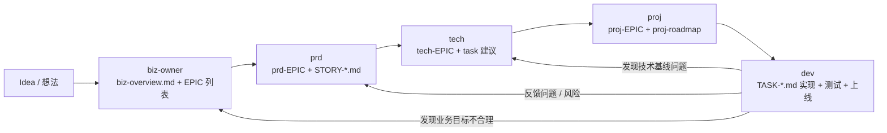
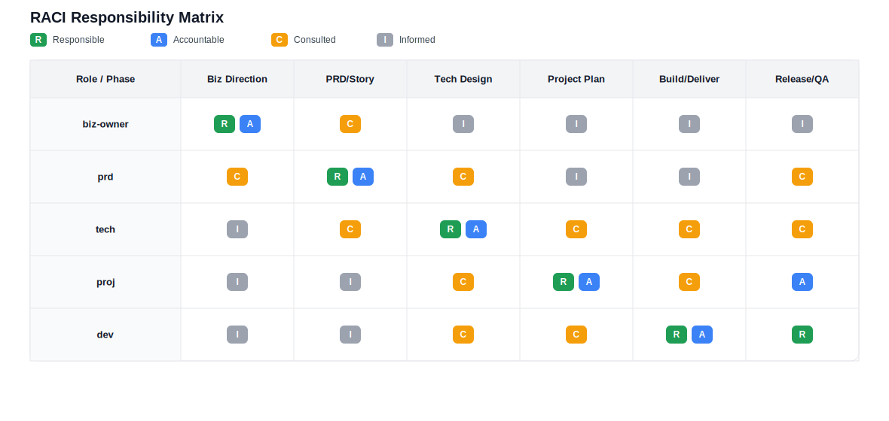

# 工作流总览：biz-owner / prd / tech / proj / dev 如何协同

Author: 大铭
Email: yinwm@outlook.com

> 建议路径：`/docs/workflow-overview.md`
> 作用：给未来的「我」和合作者说明——**一个想法从冒出来，到上线落地，这 5 个 subagent 怎么配合、文档怎么流转。**

> 当前聚焦：`/docs/E-001-群组状态管理系统-V1/tech/tech-E-001-v1.md`（tech 方案）正在迭代，所有同步相关决策与任务拆解以该文档为准，其他角色请按本工作流协同推进。

---

## 1. 总体视图：一个想法的生命线

从一个模糊想法到上线，大致会经过这 5 个角色/技能：

> 规则（强约束）：**只有 `dev` 角色可以直接修改仓库代码/配置并交付**；其他角色只能产出文档与决策建议，发现需要代码改动必须通过 `TASK-*.md` 交给 `dev` 闭环。

1. **biz-owner**：

   * 想清楚「这事值不值」「做到多大」「先做哪一块」，
   * 输出：`/docs/_project/biz-overview.md`（全局业务概览）+ EPIC 列表（E-001/E-002…）。

2. **prd**：

   * 针对某个已选 EPIC，把「要做什么」写清楚，
   * 输出：`PRD-{{EPIC_ID}}-v1.md` + `STORY-*.md`。

3. **tech**：

   * 在项目基线 + PRD 基础上，想清楚「怎么实现」，
   * 输出：项目级基线（`_project/*.md`）+ 本 EPIC 的 `TECH-{{EPIC_ID}}-v1.md` + Task 拆解建议。

4. **proj**：

   * 在现实时间 / 人力约束下，决定「这版做哪些 Story / Task、何时做完」，
   * 输出：`PROJ-{{EPIC_ID}}-v1.md` + 可选 `proj-roadmap.md`。

5. **dev**：

   * 围绕 `TASK-*.md`，一肩挑开发 / 测试 / 基础运维，
   * 输出：实际代码 & 配置 & 测试记录，并**回写**各 Task 的实现说明与状态。

可以用一句话记：

> biz-owner 定方向 → prd 写清楚要做啥 → tech 想清楚怎么做 → proj 决定怎么推进 → dev 把事情做完。

---

## 2. 文档地图（Doc Map）

整体目录结构（简化版）：

```text
/docs
  workflow-overview.md          # 本文档
  /_project
    biz-overview.md             # biz-owner 输出（全局目标/指标、EPIC 列表）
    tech-baseline.md
    arch-overview.md
    conventions/
      api-conventions.md
      db-conventions.md
      logging-observability.md
    adr/
      ADR-*.md
  /{{EPIC_DIR}}                 # 例如：E-001-履约群健康看板-V1（扁平放在 docs 下）
    prd/
      PRD-{{EPIC_ID}}-v1.md     # prd 输出
    story/
      STORY-*.md                # prd 输出
    tech/
      TECH-{{EPIC_ID}}-v1.md    # tech 输出
    task/
      TASK-*.md                 # tech/proj 定义，dev 填充
    proj/
      PROJ-{{EPIC_ID}}-v1.md    # proj 输出
```

目录已扁平化：不再使用 `BIZ_KEY/` 目录，业务目标集中在 `/docs/_project/biz-overview.md`，每个 EPIC 直接在 `/docs/` 下建目录。

核心原则：

* **每个 EPIC 都有一个自己的「小宇宙目录」**（`/{{EPIC_DIR}}/`）；
* 技术基线 / 工作流等「全局规则」，全部归在 `_project/` 下；
* 所有文档之间通过 **ID 链接**（EPIC_ID / STORY_ID / TASK_ID）而不是复制粘贴。

### 2.1 命名与 ID 约定（建议默认）

* `EPIC_ID`：Epic 编号（例如：`E-001`）
* `EPIC_DIR`：Epic 目录名（建议：`{{EPIC_ID}}-{{EPIC_NAME}}-V1`，扁平放在 `/docs/` 下）
* `STORY_ID`：Story 编号（例如：`STORY-001`，文件名建议：`STORY-001-xxx.md`）
* `TASK_ID`：Task 编号（例如：`TASK-001`，文件名建议：`TASK-001-xxx.md`）
* 文档命名建议（统一大小写，便于搜索与链接）：
  * PRD：`PRD-{{EPIC_ID}}-v1.md`（升版用 `v2/v3...`）
  * TECH：`TECH-{{EPIC_ID}}-v1.md`（升版用 `v2/v3...`）
  * PROJ：`PROJ-{{EPIC_ID}}-v1.md`（升版用 `v2/v3...`）

### 2.2 Source of Truth（单一事实来源，避免分叉）

当不同文档出现冲突时，按下面的“单一事实来源”回到源头改，避免下游到处打补丁：

| 信息/决策 | 单一事实来源 | 维护角色 | 下游使用方式 |
|---|---|---|---|
| 业务目标/指标/止损信号、Epic 级 In/Out、MVP 切法 | `/docs/_project/biz-overview.md` | biz-owner | prd/tech/proj 引用，不重写 |
| 需求主路径、边界/错误态、AC（验收标准）、需求层可观测性口径 | `prd/PRD-{{EPIC_ID}}-v*.md` + `story/STORY-*.md` | prd | tech/proj/dev 以 AC 为准做设计/拆解/验收 |
| 技术方案、模块边界、数据/API/迁移、关键 trade-off、与基线冲突点 | `tech/TECH-{{EPIC_ID}}-v*.md` + `/docs/_project/adr/*` | tech | proj/dev 以方案为准做排期与实现 |
| 版本纳入清单、里程碑、owner、Release Gate（放行标准） | `proj/PROJ-{{EPIC_ID}}-v*.md` | proj | dev 以 Gate 为准回写证据 |
| 实现事实、测试证据、上线/回滚/观测点（可复现） | `task/TASK-*.md` | dev | 给 review/验收提供证据入口 |
| 实际代码与配置 | 仓库代码 | dev | 唯一允许直接修改者 |

### 2.3 文档版本与变更规则（轻量但有护栏）

* 默认从 `v1` 开始；小修小补（措辞、补充证据、澄清）不强制升 `v2`，但要在文档 `Changelog` 里记一条。
* 触发“升版本/重新对齐”的典型变化：
  * `biz-overview`：目标/指标/止损信号、Epic In/Out、MVP 切法发生变化；
  * `PRD/Story`：主路径、关键边界、AC、需求层可观测性口径发生变化；
  * `TECH/ADR`：关键技术路径/数据模型/API/迁移策略发生变化，或出现 `[CONFLICT_WITH_BASELINE]`；
  * `PROJ`：本期纳入清单/里程碑/Release Gate 发生变化。
* 变更传播（最小重对齐链路）：
  * 改 `biz-overview` ⇒ 必须重新检查 PRD/Story/TECH/PROJ（必要时回推已开的 Task）。
  * 改 PRD/Story ⇒ 必须重新检查 TECH/PROJ，并在相关 `TASK-*.md` 标记影响。
  * 改 TECH ⇒ 必须同步 PROJ（关键路径/风险/依赖），并更新受影响的 Task 实施方案/回滚。
  * 改 PROJ ⇒ 必须同步所有纳入 Task 的目标日期、Gate 与验收责任人。

---

## 3. 单个 EPIC 的协作流程（Happy Path）

下面描述「正常一条线走完」的流程，假设我们有 EPIC `E-001 履约群健康看板 V1`。

### 3.1 阶段 1：biz-owner —— 想清楚**要不要做 / 先做什么**

**触发方式：**

* 有了一个模糊想法：
  「我想知道 1700 个履约群里面，哪些群在变坏，方便提前介入」。

**biz-owner 做什么：**

1. 进入「探索模式」：

   * 不写文档，先问：

     * 现在的痛点是什么？
     * 用户的 JTBD 是什么？（情境/触发/进展/成功标准）
     * 这个能力放在 AARRR 的哪个环节？
     * 边际成本 / 单位经济大概如何？
     * 能否用第一性原理推导出最小闭环？（约束/成本/不变量）
     * 这件事能否形成 Southwest 飞轮（综合价格/TCO）？（降门槛→扩大受众/频次→规模摊薄→继续降门槛）
     * AI 能不能拉大杠杆？
2. 当你觉得「差不多想清楚了」时：

   * biz-owner 转到「总结模式」， 
   * 输出：
    `/docs/_project/biz-overview.md`
    内含：

     * JTBD（情境/触发/进展/成功标准）
     * 核心问题（P1/P2/P3）
     * 业务目标（G1/G2/G3）
     * 成功指标
     * In Scope / Out of Scope
     * MVP 切法 & 止损点（验证周期、失败信号）
     * 关键假设 & 验证计划
     * EPIC 列表（E-001、E-002…）及本期范围

**下游依赖：**

* prd / tech / proj 都**不应该**在 biz-overview 完全缺位的情况下乱跑；
* 至少要有一个初步版 biz-overview，哪怕很多 `[OPEN]`。

---

### 3.2 阶段 2：prd —— 把某个 EPIC 写成 PRD + Story

**触发方式：**

* 你选中一个 EPIC，例如：
  `E-001 履约群健康看板 V1`，
  然后对 prd 说：「用 prd 帮我写这个 EPIC」。

**prd 做什么：**

1. 读：

   * `/docs/_project/biz-overview.md`
   * 已选 EPIC 的摘要（范围 / 目标）
2. 进入「探索模式」：

   * 针对这一个 EPIC 问清楚：

     * 用户角色：谁在用？（运营 / 项目负责人 / 老板…）
     * 使用场景：啥时候打开？想完成什么？
     * 功能列表：F1/F2/F3… 优先级？
     * 体验北极星：1 句 North Star + 3 条体验原则（用于做取舍）
     * 交互模型：表单/流程/AI 对话/混合？主路径是否最短？
     * 状态与边界：关键对象/流程的状态机、异常/错误态、恢复路径
     * 交互草图：可以用 ASCII 线框；
     * 验收标准：什么时候算「做到位」？
     * 需求层可观测性：怎么观测成功与失败（埋点/日志/报表口径）
     * 发布约束：是否需要开关/灰度/回滚/用户通知等（需求层描述）
     * AI Native（如涉及）：何时自动/何时确认/何时人审、引用/可解释性、降级策略与 AI 相关 AC
3. 进入「总结模式」：

   * 输出：

     * `prd/PRD-E-001-v1.md`
     * `story/STORY-001-*.md` / `STORY-002-*.md` …

**协作要点：**

* prd 必须**尊重 biz-overview 里的目标和范围**，不能自己瞎定义一个新目标；
* Story 文件要能「单独阅读」，让 tech / dev 只看 Story 也能理解一条需求。

---

### 3.2.1 阶段 1 ↔ 阶段 2 的边界（建议作为默认协作契约）

**角色职责（谁“拍板”什么）**

* biz-owner 决定：做不做、先做什么、做到哪；JTBD/目标；**业务结果指标（KPI/OKR）与止损信号**；Epic 级 In/Out；MVP 切法；关键假设与验证计划。
* prd 决定：交互范式与体验原则；状态机/边界/错误态；可测试的 AC；**需求层可观测性口径**（埋点/日志/报表，如何观测业务指标）；发布约束（需求层）。

**术语约定（避免“指标口径”打架）**

* 业务结果指标（biz-owner）：衡量业务是否变好/变差的结果指标与口径（例如转化率、留存、GMV、人工介入成本），以及“失败/止损信号”。
* 需求层可观测性（prd）：为验证业务结果指标而设计的观测方案与口径（事件、维表、报表字段、日志/审计），强调“如何测得出来”，不重新定义“测什么才算成功”。

**升级规则（何时必须回到 biz-owner）**

* prd 发现必须调整目标、业务结果指标/口径、止损信号、或 Epic In/Out：必须升级给 biz-owner 重新拍板（prd 可以提出选项与影响分析，但不单方面改）。
* biz-owner 在 PRD/Story 阶段新增目标或扩大 Epic In/Out：必须同步让 prd 重做范围与验收（避免下游在旧需求上继续拆分）。

**交接物（建议的最小“对齐包”）**

* biz-owner → prd：当前选定 Epic、In/Out、目标与业务结果指标/止损信号、关键假设&验证计划、不可妥协约束（合规/资源/期限）。
* prd → biz-owner（回签）：North Star + 体验原则、主路径、关键取舍（会影响范围/指标/止损的）、`[OPEN]` 清单与待决点。
* AI 相关建议分层：
  * biz-owner：AI 是否是本期杠杆/差异化的一部分（业务决策）。
  * prd：AI 体验与验收（自动/确认/人审、引用/可解释性、降级、AC）。
  * tech：AI 工程实现与选型（模型/RAG/成本/安全/可观测性等）。

### 3.3 阶段 3：tech —— 想清楚**怎么实现**

**触发方式：**

* E-001 的 PRD + Story 已经出来，你对 tech 说：
  「这个 EPIC 用 tech 帮我出一版技术方案」。

**tech 做什么：**

1. 在 **项目级模式** 下（如果还没建好基线）：

   * 和你一起在 `_project` 目录下起草：

     * `tech-baseline.md`（语言 / 框架 / monorepo / infra）；
     * `arch-overview.md`（整体系统架构图）；
     * `conventions/*.md`（API / DB / Logging 规范）；
     * 关键 ADR（如 Micronaut vs Spring 等）。
2. 在 **Epic 级模式** 下：

   * 读：

     * `biz-overview.md`；
     * `prd/PRD-E-001-v1.md`；
     * `story/STORY-*.md`；
     * `_project/` 里的基线与规范；
     * 相关代码与既有实现（避免重复造轮子）。
   * 在「探索模式」下搞清楚：

     * 会改动哪些服务 / 模块 / DB 表 / 接口；
     * 会引入哪些异步任务 / 定时任务；
     * 有什么性能 / 安全 / 可观测性要求；
     * 有哪些既有能力可复用/扩展（避免重复实现）。
   * 在「总结模式」下输出：

     * `tech/TECH-E-001-v1.md`：

       * 现状架构 → 目标架构；
       * 数据模型；
       * API / 事件 / 任务；
       * NFR（性能 / 权限 / 日志等）；
       * 风险 & Trade-off；
       * 建议的开发顺序；
     * 同时给出一份 **Task 拆解建议**（可以写在 tech 文档里供 proj/dev 用）。
     * （建议）Epic 级 TECH 文档结构参考 `docs/_templates/tech-epic.md`，并显式写出“现有可复用点/需要扩展的既有模块”。

**协作要点：**

* Epic 级技术方案（`TECH-{{EPIC_ID}}-v1.md`）默认遵守 `_project` 的基线；
* 如需偏离，用 `[CONFLICT_WITH_BASELINE]` 标出，并建议写 ADR。

---

### 3.3.1 阶段 2 ↔ 阶段 3 的边界（prd ↔ tech）

**角色职责（谁“拍板”什么）**

* prd：拍板需求侧“做什么”——交互与体验原则、状态机/边界/错误态、AC、发布约束（需求层），以及需求层可观测性口径（为了观测与验收业务目标，需要哪些埋点/日志/报表维度与字段）。
* tech：拍板技术侧“怎么做”——模块/服务边界、数据模型与迁移策略、API/事件/任务设计、工程侧 NFR（性能/权限/审计/工程可观测性：日志/指标/tracing）、以及任务拆解建议与依赖顺序。

**升级规则（何时必须回到 prd / biz-owner）**

* tech 发现 PRD/Story 不足以落地（需求矛盾/关键定义缺失/验收不可测试/需求层可观测性缺失）：升级给 prd 补齐或改写（tech 提供选项、影响与建议取舍）。
* tech 发现必须调整业务目标、业务结果指标/止损信号、或 Epic 级 In/Out：升级给 biz-owner 重新拍板（通常同步 prd，避免下游继续在旧前提上拆分）。
* tech 发现必须偏离 `_project` 基线：在技术方案中用 `[CONFLICT_WITH_BASELINE]` 标出，并建议写 ADR。

**交接物（建议的最小“对齐包”）**

* prd → tech：PRD + Story（含 AC 与需求层可观测性口径）、与 biz-overview 的引用关系、`[OPEN]` 清单与待决点。
* tech → prd（回推）：实现约束/Trade-off、需要澄清的需求点、可能影响体验/范围/验收的变更建议。

---

### 3.3.2 阶段 3 ↔ 阶段 4 的边界（tech ↔ proj）

**角色职责（谁“拍板”什么）**

* tech：拍板技术可行性与实现路径——任务拆解建议、关键依赖与风险、建议的开发顺序、工程侧 NFR（性能/权限/审计/工程可观测性）。
* proj：拍板交付推进与版本纳入——本次发布纳入哪些 Story/Task、里程碑与关键路径、owner 分配、节奏与变更控制。

**升级规则（何时必须回到上游）**

* proj 发现死线/资源无法满足当前范围：回推 `biz-owner/prd/tech` 做范围降级或方案降级，再更新计划。
* tech 发现方案/拆解发生关键变化（依赖变更、成本/风险上升）：同步 proj 更新关键路径与里程碑，并必要时回推 prd/biz-owner 做取舍。

**交接物（建议的最小“对齐包”）**

* tech → proj：TECH 文档 + 任务拆解建议（依赖/顺序/风险/不可并行点/上线迁移注意事项）。
* proj → tech：本期纳入清单（Story/Task）、里程碑节点、资源配置与死线约束（便于 tech 评估是否需要降级或分期）。

---

### 3.4 阶段 4：proj —— 决定**这版具体做什么 / 何时做完**

**触发方式：**

* 对 proj 说：「E-001 的 PRD & tech 都有了，帮我出一个版本计划」。

**proj 做什么：**

1. 读：

   * `/docs/_project/biz-overview.md`
   * `prd/PRD-E-001-v1.md`
   * `story/STORY-*.md`
   * `tech/TECH-E-001-v1.md`
   * 已有的 Task 建议（如果有）

2. 在「探索模式」下搞清楚：

   * 时间约束：什么时候必须上线？
   * 人力约束：FE/BE/QA/运维各有多少精力？
   * 范围约束：哪些 Story 不做这版就没有意义？

3. 在「总结模式」下输出：

   * `proj/PROJ-E-001-v1.md`：

     * 本版纳入的 Story 列表；
     * 明确 Out of Scope 的 Story（以后再做）；
     * 人力配置，里程碑（M1~M5）；
     * Task 总览表（引用各 `TASK-*.md`）；
     * 严格的“验收与上线门槛（Release Gate）”（AC、测试用例与结果、回滚与观测点）；
     * 风险 / 依赖 / 例会节奏 / 变更记录。
   * （建议）Epic 级 PROJ 文档结构参考 `docs/_templates/proj-epic.md`，并把验收证据尽量回写到 `TASK-*.md`。

4. 可选：做全局版本路标：

   * 输出 `/docs/_project/proj-roadmap.md`（按需），横向管理多个 EPIC 的优先级和时间轴。

**协作要点：**

* proj **不改业务目标、不改技术方案**，只在现实约束下优化排序和范围；
* 如果发现「现有 scope 不可能在指定时间内做完」，要拉响警报并推回 biz-owner / prd / tech 协调。

---

### 3.4.1 阶段 4 ↔ 阶段 5 的边界（proj ↔ dev）

**角色职责（谁“拍板”什么）**

* proj：拍板版本纳入与 Release Gate——纳入哪些 Task、里程碑与 owner、上线前“验收与上线门槛”。
* dev：拍板工程实现与交付质量——按 Task 交付代码/测试/上线准备，并在 `TASK-*.md` 回写验收证据（AC、测试用例与结果、回滚与观测点）。

**硬护栏（什么时候才算 DONE）**

* dev 不得在缺少验收证据时把 Task 标为 `DONE`；若无法满足 Release Gate，应标 `BLOCKED` 或保持 `DOING` 并写清原因，回推 proj/prd/tech 协调。

**交接物（建议的最小“对齐包”）**

* proj → dev：本期纳入 Task 清单（含优先级、owner、目标日期）+ Release Gate（验收负责人/方式、必过清单、回归点）。
* dev → proj：各 Task 的 `TASK-*.md` 回写链接（实现说明/测试结果/回滚/观测点）+ 风险与阻塞项清单。

---

### 3.5 阶段 5：dev —— 真正**把事情做完**

**触发方式：**

* 某个版本的 `PROJ-E-001-v1.md` 已经确定；
* 对 dev 说：「从 proj 里选出来的这些 Task，用 dev 帮我一条条落地」。

**dev 做什么：**

工作粒度：**Task 为单位**。

1. 读：

   * `TASK-*.md`（自己要做的那几条）；
   * 对应的：

     * Story；
     * `TECH-{{EPIC_ID}}-v1.md`；
     * PRD 小节；
     * proj 里程碑。
2. 动手前先做“复用检查”（避免重复造轮子）：

   * 在代码库中定位是否已有类似实现/通用能力；
   * 优先复用或在既有实现上扩展，并在 `TASK-*.md` 回写复用点（关键模块/函数/路径）；
   * 如果确实需要新建实现，也要写清“不复用”的理由。

3. 在 Task 内补充/更新：

   * 实现说明（Implementation）：

     * 改哪些模块 / 文件 / 表；
     * 关键接口 / 函数 / SQL；
     * 必要的小范围重构（增量且兼容）：把不通用代码抽成可复用能力，并保证旧调用兼容；
   * 测试计划与结果（Test Plan & Results）：

     * 单测 / 集测 / 手工验收；
   * 上线步骤 / 回滚方案（Deployment & Rollback）：

     * CI/CD、配置、迁移脚本。
4. 变更 Task 状态：

   * TODO → DOING → DONE / BLOCKED；
   * 同步回写「正在做什么（Now）/ 下一步（Next）/ 阻塞点（Blockers）」；
   * 如遇问题，用 `[OPEN]` / `[RISK]` 明确记录。

**协作要点：**

* dev 不「偷偷改架构/基线」，发现问题要在 Task / tech / ADR 层提出；
* dev 完成任务后，要留下足够的「工程 breadcrumb」：

  * 关键代码位置；
  * 重要配置；
  * 所做的测试。

---

### 3.5.1 代码 Review 与验收检查点（方案 A：不新增角色）

> 目的：提升质量与一致性（复用、基线、测试证据、回滚与观测点），但不引入第六个角色。  
> 规则：Review/验收阶段 **所有角色都只读代码**，只能提意见与要求改动；**只有 `dev` 可以实际修改仓库代码/配置**。

**触发时机（建议作为默认）**

* 任一 P0/P1 Task 在标记 `DONE` 前；
* 进入里程碑“验收 & 上线”前（Release Gate）；
* 涉及数据迁移/权限/关键路径/NFR/跨模块改动时，强制触发。

**各角色检查点（谁看什么）**

* tech（代码评审：架构/复用/基线，只读）：
  * 是否复用既有能力、避免重复造轮子；
  * 是否遵守 `_project` 基线与 conventions；如需偏离是否标注并走 ADR；
  * 改动面是否可控、是否引入不必要耦合，是否需要小范围重构以沉淀通用能力；
  * 迁移/兼容/回滚策略是否可落地。
  * （建议）评审输出格式参考 `docs/_templates/code-review-tech.md`。
* prd（需求验收：AC/边界，只读）：
  * Story/Task 的 AC 是否逐条满足且可复现；
  * 边界/错误态/权限是否覆盖，体验是否符合 PRD/Story 描述；
  * 需求层可观测性口径是否在交付中体现（至少能“验收测得出来”）。
* proj（Release Gate 审计：证据/放行，只读）：
  * `PROJ-*.md` 的 Release Gate 是否满足（验收负责人/方式、必过清单、回归点）；
  * `TASK-*.md` 是否回写了测试结果、回滚方案、上线观测点；
  * 若不满足 Gate：要求 dev 继续补齐或将任务置为 `BLOCKED/DOING` 并协调调整范围/里程碑。

---

## 4. 多角色在同一个人脑子里的切换规则

现实情况：**你一个人可能扮演所有角色**。
那怎么用这套「多人协作的流程」而不把自己搞疯？

建议：

1. **用目录+文档来隔离角色，而不是用大脑强行切人格**：

   * 想生意的时候 → 只打开 `_project/` + `biz-overview`；
   * 写需求的时候 → 只打开 `prd/` + `story/`；
   * 想技术方案的时候 → 只打开 `_project/*` + `tech/`；
   * 排期的时候 → 只打开 `proj/`；
   * 写代码的时候 → 只打开 `task/` + 代码仓库。

2. **用 subagent 名称来提醒自己当前模式**：

   * 「现在用 biz-owner subagent 和自己聊半小时，只输出小结，不写代码」；
   * 「现在切到 prd subagent，把刚才的结论变成 PRD」；
   * 「再切到 tech subagent，看在现有栈下怎么做最合理」；
   * 「然后切到 proj subagent，排期排活定版本」；
   * 「最后才打开 dev subagent，一条条 Task 干活」。

3. **用文档来保留「上下文」，而不是指望 AI 记得过去所有对话**：

   * 每个阶段结束时，都输出一份对应的 md 文件；
   * 下一次从那份 md 接着走，而不是从零复述。

---

## 5. 最短路径与跳步规则（允许「偷懒」，但要有护栏）

在小团队里，有时候你会觉得：

* 「这个需求特别小，我要不要一股脑直接写代码？」

可以，但建议遵守几个「最低文档护栏」：

1. **任何进入代码阶段的东西，都至少要有一个 Story + 一个 Task：**

   * 超小需求也可以用一个 mini Story + mini Task；
   * 不一定要完整 biz-overview + PRD，但要能说清：

     * 用户是谁；
     * 想解决什么问题；
     * 完成标准是什么。

2. **能省则省，但不要混：**

   * 你可以把 PRD 写得很短（甚至就是 Story），
     但不要把技术方案、项目计划、实现细节全部塞进一个文档；
   * 规范是为未来做准备：
     「三个月后的你」会感谢现在多写的这几行。

3. **跳步前先问一句：**

   * 「这个东西如果做失败 / 返工，会不会很痛？」
   * 如果会，很痛，就走完 biz-owner → prd → tech → proj → dev 全链路；
   * 如果就是「改个按钮文字」，Story + Task 足够。

---

## 6. Subagent 使用方式

在实际使用中，通过调用 subagent 来触发各个角色的工作：

```bash
# 业务分析 - 使用 biz-owner subagent
@agent-biz-owner  # 或 /agent biz-owner

# 需求文档 - 使用 prd subagent
@agent-prd        # 或 /agent prd

# 技术设计 - 使用 tech subagent
@agent-tech       # 或 /agent tech

# 项目规划 - 使用 proj subagent
@agent-proj       # 或 /agent proj

# 开发实现 - 使用 dev subagent
@agent-dev        # 或 /agent dev
```

## 7. 一个简单的「协同流程图」

> 只是示意，不强求和实际目录完全一致。



---

## 8. RACI 责任矩阵（找谁）

说明：R=负责执行，A=最终拍板，C=需要咨询，I=需要知情。  
图形版：`docs/raci-matrix.svg`

| 角色/阶段 | Biz 方向 | PRD/Story | 技术方案 | 项目计划 | 开发交付 | 验收发布 |
| --- | --- | --- | --- | --- | --- | --- |
| biz-owner | R/A | C | I | I | I | I |
| prd | C | R/A | C | I | I | C |
| tech | I | C | R/A | C | C | C |
| proj | I | I | C | R/A | C | A |
| dev | I | I | C | C | R/A | R |




---

## 9. 最后一句话：谁拍板什么？

* **biz-owner**：拍板「这事值不值、先做哪个 EPIC」；
* **prd**：拍板「用户视角下，这版到底要做到什么程度」；
* **tech**：拍板「在现有栈下，怎么做是合理的」；
* **proj**：拍板「这版到底做多少、什么时候上线、出了事怎么调整」；
* **dev**：拍板「代码是否写好、是否测过、能不能安全上线」。

补充规则：除 `dev` 外，其他角色**不得**直接修改仓库代码/配置（可以提出建议与伪代码/接口草案，但落地必须交给 `dev`）。

同一个人可以兼任所有帽子，
但**每个决策都应该落在一个清晰的文档里**，
这样你未来再看，就知道「当时的自己到底是怎么想的」。
